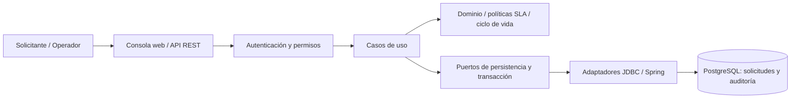

# Service Request Platform

[](https://github.com/jorgefprietol/service-request-platform/actions/workflows/ci.yml)

Plataforma de operaciones para registrar solicitudes, asignar operadores, aplicar plazos de SLA y conservar una auditoría transaccional. Implementada en **Java 21, Spring Boot, PostgreSQL y OIDC**, con una consola web, contrato OpenAPI y entrega de contenedores mediante GitHub Actions.

El diseño conecta requisitos de negocio con casos de uso, reglas de dominio, adaptadores y pruebas. Las dependencias de arquitectura se verifican automáticamente con ArchUnit.

## Capacidades

- Creación idempotente por cliente, incluso ante solicitudes concurrentes y reinicios.
- Priorización `LOW`, `NORMAL`, `HIGH`, `CRITICAL` con plazos de 72, 24, 8 y 2 horas continuas.
- Flujo de atención con reapertura y estados terminales; cada cambio requiere la versión vigente.
- Plantillas inmutables para provisión de acceso e interrupción de servicio.
- Usuarios individuales mediante OIDC, con firma, emisor, audiencia y vigencia verificados.
- Visibilidad por subject autenticado y permisos por roles para transiciones, asignación y métricas.
- Asignación a operadores registrados, con revisión vigente y auditoría del actor y destinatario.
- Monitor de SLA con alertas persistentes, deduplicadas y visibles en la consola de operaciones.
- Persistencia y auditoría en una misma transacción; fallos parciales producen rollback.
- Readiness dependiente de PostgreSQL, liveness independiente y recuperación verificada.



## Ejecutar

Requisitos: Docker con contenedores Linux, Docker Compose y Python 3.11 o superior. Python se usa para generar credenciales y verificar el stack; no forma parte del contenedor de la aplicación.

```powershell
git clone https://github.com/jorgefprietol/service-request-platform.git
cd service-request-platform
python scripts/init_env.py
docker compose up -d --build --wait --wait-timeout 300
```

Consola: **http://127.0.0.1:18110**. Identidad local: **http://127.0.0.1:18112**. Contrato: **http://127.0.0.1:18110/openapi.yaml**.

Selecciona **Ingresar con identidad** en la consola. El flujo usa Authorization Code con PKCE, y el access token permanece únicamente en memoria. El generador conserva las credenciales existentes, añade configuración faltante y no imprime secretos.

| Cuenta local de verificación | Rol | Contraseña en `.env` |
| --- | --- | --- |
| `requester.one` | Solicitante | `IDENTITY_REQUESTER_PASSWORD` |
| `requester.two` | Solicitante | `IDENTITY_SECOND_REQUESTER_PASSWORD` |
| `operations.primary` | Operador | `IDENTITY_OPERATOR_PASSWORD` |

Cada cuenta tiene un subject propio emitido por Keycloak. Un operador aparece en el directorio de asignación después de conectarse. Las cuentas incluidas son identidades de verificación del entorno local, con contraseñas aleatorias; no representan usuarios de una organización externa.

El contenedor de la API ejecuta UID 10001, filesystem de solo lectura, capacidades eliminadas y límites de recursos. El puerto se publica en loopback; PostgreSQL permanece dentro de la red de Compose. Los datos se guardan en un volumen persistente.

## API

| Operación | Endpoint | Condición |
| --- | --- | --- |
| Crear | `POST /api/requests` | Bearer token y `Idempotency-Key` |
| Listar | `GET /api/requests?limit=50&offset=0` | Máximo 100 por página |
| Consultar | `GET /api/requests/{id}` | Devuelve `ETag` |
| Cambiar estado | `POST /api/requests/{id}/transitions` | Operador y `If-Match: "0"` |
| Auditar | `GET /api/requests/{id}/history` | Mismo alcance de visibilidad |
| Plantillas | `GET /api/templates` | Bearer token |
| Instanciar | `POST /api/templates/{templateId}/requests` | Bearer token e idempotencia |
| Identidad | `GET /api/me` | Subject, nombre visible y roles verificados |
| Operadores | `GET /api/operators` | Operador; directorio de identidades registradas |
| Asignar | `POST /api/requests/{id}/assignment` | Operador, subject registrado e `If-Match` |
| Alertas SLA | `GET /api/alerts` | Operador; hasta 100 alertas activas |
| Readiness | `GET /actuator/health/readiness` | Público, sin detalles internos |
| Métricas | `GET /actuator/metrics` | Operador |

Ejemplo PowerShell sin incorporar credenciales al historial:

```powershell
$settings = @{}
Get-Content .env | ForEach-Object {
    if ($_ -match '^([^#=]+)=(.*)$') { $settings[$Matches[1]] = $Matches[2] }
}
$access = Invoke-RestMethod 'http://127.0.0.1:18112/realms/service-requests/protocol/openid-connect/token' -Method Post -Body @{ grant_type = 'password'; client_id = 'service-request-verification'; username = 'requester.one'; password = $settings.IDENTITY_REQUESTER_PASSWORD }
$headers = @{ Authorization = "Bearer $($access.access_token)"; 'Idempotency-Key' = [guid]::NewGuid().ToString() }
$body = @{ title = 'Restaurar servicio de inventario'; description = 'Investigar interrupción y recuperar disponibilidad'; priority = 'HIGH' } | ConvertTo-Json
Invoke-RestMethod 'http://127.0.0.1:18110/api/requests' -Method Post -Headers $headers -ContentType 'application/json' -Body $body
```

Una repetición con la misma clave y contenido normalizado devuelve la solicitud actual con HTTP 200; la primera creación devuelve 201. Cambiar contenido bajo la misma clave devuelve 409. Las claves se conservan mientras exista la solicitud y se aíslan por principal.

## Verificar

```powershell
# JDK 21 y Maven 3.9+
mvn -B -ntp verify

# Con el stack de Compose activo
python scripts/e2e.py
```

Las pruebas cubren dominio, todas las combinaciones de estados, API, permisos, transacciones, carreras y reglas de dependencia. JaCoCo exige **90% de líneas del paquete de dominio**. La verificación end-to-end usa PostgreSQL y Keycloak reales, comprueba JWT y aislamiento entre usuarios, introduce un fallo de auditoría, verifica asignación y alertas, reinicia la API y prueba una interrupción de base de datos. Genera `artifacts/e2e.json`; crea solicitudes de verificación en el entorno local.

## Entrega

El pipeline valida Java en Linux y Windows, construye la imagen una sola vez, prueba el stack, escanea secretos y vulnerabilidades y genera un SBOM CycloneDX. Los hallazgos HIGH/CRITICAL con corrección disponible bloquean la entrega. Tras superar esas etapas, publica **la misma imagen probada** en `ghcr.io/jorgefprietol/service-request-platform:sha-<commit>` y `:main`, con atestación de procedencia. Los PR usan runners hospedados y no reciben permisos de publicación.

GitHub Actions conserva evidencias de pruebas, cobertura, integración y análisis de seguridad. Las imágenes base y acciones están fijadas por digest o SHA; Dependabot propone actualizaciones.

## Documentación

- [Requisitos, actores y priorización](docs/requirements.md)
- [Arquitectura, clases, datos y patrones](docs/architecture.md)
- [Decisiones y alternativas](docs/decisions.md)
- [Operación, credenciales y recuperación](docs/operations.md)
- [Verificación y evidencia](docs/verification.md)
- [Evolución y deuda técnica](docs/roadmap.md)
- [Descripción profesional del proyecto](docs/experience.md)

El alcance actual es un proyecto independiente de ingeniería con despliegue local. Keycloak usa `start-dev` y un volumen local para demostrar el flujo OIDC; una adopción compartida requiere un proveedor configurado para producción, TLS, controles perimetrales y backups. El cliente con password grant se reserva para comprobaciones automatizadas y debe deshabilitarse fuera de ese entorno. Los tokens estáticos solo se aceptan bajo el modo explícito `development-tokens`, utilizado por pruebas rápidas. Los SLA son plazos en horas continuas; las alertas se consultan en la plataforma, sin correo ni mensajes externos. La auditoría es append-only a través de la API; un administrador de base de datos conserva capacidad de modificarla.

Autor: **Jorge Prieto**. Licencia MIT.
