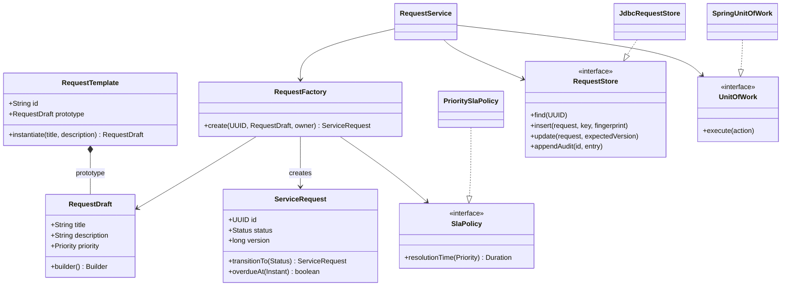
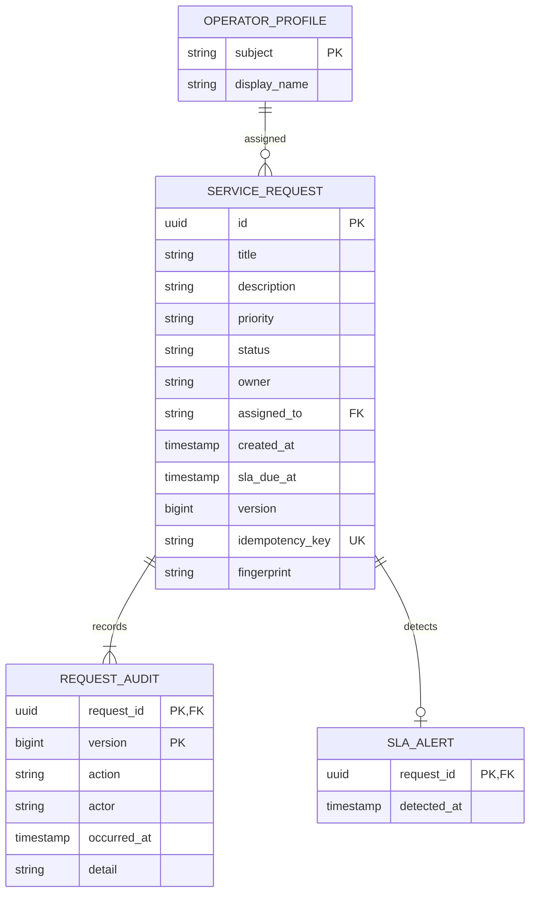
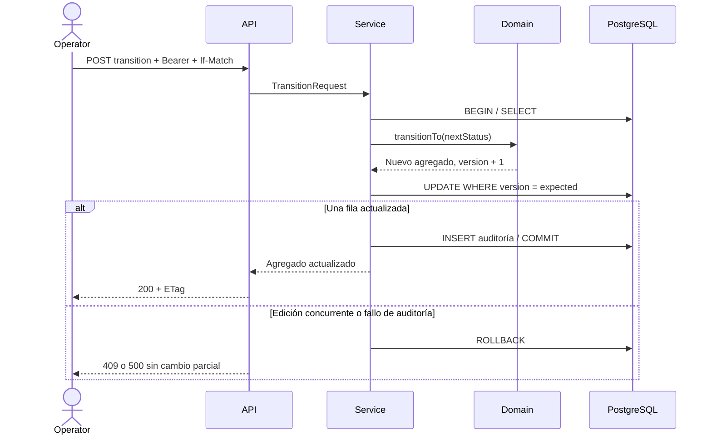

# Arquitectura y patrones

## Estructura

Monolito modular con arquitectura limpia. Una sola unidad de despliegue concentra solicitudes, SLA y auditoría: su transacción compartida reduce coordinación distribuida y facilita mantenimiento. La separación está en las dependencias del código.

| Capa | Responsabilidad | Dependencias permitidas |
| --- | --- | --- |
| `domain` | Invariantes, estados, borradores, SLA y fábrica | Java y dominio |
| `application` | Casos de uso, comandos, idempotencia, puertos | Java, aplicación y dominio |
| `api` | HTTP, DTO, validación de transporte y errores | Aplicación y dominio; sin JDBC |
| `infrastructure` | SQL y adaptador transaccional | Puertos y Spring JDBC |
| `config` | Composición y permisos | Todas las capas necesarias para cableado |

ArchUnit impide dependencias salientes del núcleo y el acceso SQL desde HTTP. Las entidades no usan anotaciones ORM ni conocen Spring. El reloj y la política SLA se inyectan; las pruebas del dominio son deterministas.

## Modelo de clases

## Modelo de datos

Una solicitud tiene una o más entradas de auditoría. La clave primaria compuesta asegura una entrada por revisión. La clave de idempotencia combina principal y clave de cliente; un hash SHA-256 del contenido normalizado detecta reutilización incompatible. Los campos se serializan con prefijos de longitud para evitar ambigüedad por separadores.

La creación y auditoría comparten transacción. Ante una carrera de inserción, el perdedor sale de la transacción abortada y consulta en una nueva transacción. Las transiciones usan `UPDATE ... WHERE id = ? AND version = ?`: el contador de filas decide si la versión todavía es vigente.

## Secuencia de transición

## Patrones aplicados

| Patrón | Implementación | Necesidad resuelta |
| --- | --- | --- |
| Fábrica simple | `RequestFactory` | Centralizar identidad, estado inicial, reloj y plazo sin duplicar reglas |
| Builder | `RequestDraft.Builder` | Componer borradores con valores por defecto y validación al construir |
| Prototype | `RequestTemplate.instantiate` | Copiar valores de un prototipo inmutable sin compartir estado mutable |
| Strategy | `SlaPolicy` / `PrioritySlaPolicy` | Cambiar cálculo de SLA sin alterar la fábrica ni el servicio |
| Command | `TransitionRequest` | Transportar intención explícita, actor y revisión al caso de uso |
| Repository / DAO | `RequestStore` / `JdbcRequestStore` | Separar negocio de consultas y mapeo SQL |
| Adapter | `SpringUnitOfWork` | Adaptar la transacción del framework al puerto del núcleo |
| DTO | Entradas HTTP y `RequestView` | Definir el contrato de transporte y calcular estado derivado |

Los beans de composición tienen alcance singleton administrado por Spring, sin implementar un acceso global estático. Se evita un singleton manual porque dificulta sustituir dependencias y aislar pruebas. No se incorpora Factory Method con jerarquías de productos, Observer distribuido, ni microservicios: no existe una variación actual que justifique esa complejidad.

## SOLID y código limpio

SRP: dominio valida reglas, servicio coordina casos de uso, adaptador escribe SQL, controlador traduce HTTP. OCP: una nueva política SLA se conecta a través de `SlaPolicy`. LSP: implementaciones de puertos conservan las mismas expectativas de transacción y conteo de actualización. ISP: persistencia y transacción tienen interfaces separadas; el servicio no recibe un cliente JDBC completo. DIP: aplicación depende de puertos propios.

KISS y YAGNI guían un único servicio y transacciones locales. DRY centraliza creación y transiciones. La ley de Demeter se refleja en que HTTP invoca casos de uso sin navegar conexiones ni detalles de SQL. Los agregados son inmutables y devuelven una nueva revisión en cada cambio.

## Límites

La auditoría protege integridad de la API, pero no es almacenamiento WORM ni prueba criptográfica. El servicio no envía mensajes externos ni ejecuta pagos. El vencimiento se deriva al consultar y un monitor periódico guarda alertas durables con unicidad por solicitud. Reapertura conserva el plazo original y reactiva la detección previa si sigue vencida. La paginación por offset puede variar bajo nuevas inserciones; no promete una fotografía consistente entre páginas.

## Identidad y asignación

La consola usa Authorization Code con PKCE. Spring Security valida firma RS256, emisor, audiencia y fechas del access token antes de mapear únicamente roles requester/operator. El subject del JWT identifica propietario, actor y operador asignado; el nombre visible no determina permisos. El transporte usa el emisor público y obtiene claves mediante la dirección interna configurada del proveedor.

`OperatorDirectory` y `AssignmentService` mantienen el caso de uso de asignación separado de creación y transiciones. Asignación y auditoría comparten transacción y control optimista; asignar de nuevo el mismo operador con la revisión vigente es una operación sin cambios. El catálogo conserva operadores autenticados previamente y no concede acceso por estar registrado: cada petición sigue requiriendo un token vigente con el rol adecuado.

`SlaAlertStore` aplica una inserción selectiva con `ON CONFLICT DO NOTHING`. Varios monitores pueden detectar una misma solicitud sin duplicar alertas. La consulta muestra alertas solo para OPEN/IN_PROGRESS y limita la respuesta a 100 elementos; el registro persiste para conservar trazabilidad de detección.
