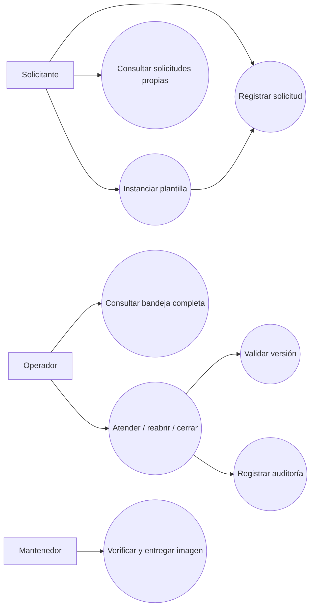

# Especificación de requisitos

## Contexto y objetivo

Las solicitudes operativas dispersas dificultan priorizar, detectar vencimientos y reconstruir decisiones. El sistema centraliza la atención y mantiene una relación verificable entre solicitud, estado, plazo, actor y revisión.

Esta especificación utiliza una estructura explícita de alcance, interfaces, funciones, restricciones y criterios de aceptación. Las necesidades son hipótesis del proyecto; no se atribuyen entrevistas ni acuerdos a una organización externa.

## Actores y personas

| Actor | Contexto | Necesidad | Restricción |
| --- | --- | --- | --- |
| Solicitante | Registra una necesidad operativa | Confirmación sin duplicados y consulta de su historial | No decide estados de atención |
| Operador | Atiende una bandeja compartida | Prioridad, SLA y transiciones consistentes | Debe trabajar con la revisión vigente |
| Responsable técnico | Mantiene y entrega el sistema | Evidencia reproducible y recuperación de fallos | No publica artefactos sin validación |

Elicitación prevista para una adopción: entrevistar a responsables de soporte, revisar categorías y calendarios de atención, acordar límites de retención y validar prototipos con usuarios. Estas actividades quedan pendientes de un contexto organizacional real.

## Requisitos funcionales y trazabilidad

| ID | Requisito / historia de usuario | MoSCoW | Aceptación y evidencia |
| --- | --- | --- | --- |
| RF-01 | Como solicitante, registro título, descripción y prioridad | Must | 201, identidad única, estado OPEN y auditoría cero; pruebas API y E2E |
| RF-02 | Como cliente, reintento una creación sin duplicarla | Must | Una creación entre ocho clientes concurrentes; cambio de contenido produce 409 |
| RF-03 | Como solicitante, consulto únicamente solicitudes de mi identidad | Must | Recurso ajeno devuelve 404; listado filtrado por principal |
| RF-04 | Como operador, avanzo o reabro una atención | Must | Solo transiciones declaradas; todas las combinaciones se verifican |
| RF-05 | Como operador, detecto una revisión obsoleta | Must | Entre dos transiciones con la misma versión, una confirma y otra recibe 409 |
| RF-06 | Como responsable, reconstruyo acciones y actores | Must | Una auditoría por versión; fallo de auditoría revierte la mutación |
| RF-07 | Como operador, identifico plazos según prioridad | Must | LOW 72h, NORMAL 24h, HIGH 8h, CRITICAL 2h; vencimiento calculado en consulta |
| RF-08 | Como solicitante, reutilizo una plantilla | Should | Nueva identidad y valores heredados sin modificar el prototipo |
| RF-09 | Como usuario, opero desde una consola accesible | Should | Formularios etiquetados, estado anunciado, contenido insertado como texto |
| RF-10 | Como integrador, consulto un contrato de API | Should | OpenAPI versionado y disponible en HTTP |
| RF-11 | Como mantenedor, publico una imagen validada | Must | GitHub Actions conserva pruebas y publica el artefacto probado por SHA |
| RF-12 | Como operador, asigno atención a una identidad registrada | Must | Subject de operador verificado, ETag vigente, auditoría con actor y destinatario |
| RF-13 | Como organización, facturo contratos de atención | Won't | Fuera del alcance actual |
| RF-14 | Como usuario, ingreso con identidad OIDC individual | Must | Firma, issuer, audience y vigencia válidos; usuarios distintos quedan aislados |
| RF-15 | Como operador, consulto alertas de SLA vencido | Should | Una alerta durable por solicitud; reinicio conserva detección; estados terminales suprimen alertas activas |

## Requisitos de calidad

| ID | Atributo | Escenario medible | Verificación |
| --- | --- | --- | --- |
| RNF-01 | Integridad | 0 solicitudes duplicadas en ocho reintentos concurrentes con una clave | E2E PostgreSQL |
| RNF-02 | Consistencia | 0 revisiones confirmadas sin su auditoría ante fallo de escritura | Rollback con constraint PostgreSQL |
| RNF-03 | Recuperabilidad | Datos, revisión, auditoría y claves sobreviven reinicios de API y DB | E2E |
| RNF-04 | Mantenibilidad | Dominio y aplicación no dependen de Spring, JDBC ni HTTP | Tres reglas ArchUnit |
| RNF-05 | Testabilidad | Cobertura de líneas del dominio >= 90% | Umbral obligatorio JaCoCo |
| RNF-06 | Seguridad | 401 sin credencial; 403 para transiciones sin rol; 404 para recursos ajenos | API y E2E |
| RNF-07 | Operabilidad | Readiness 503 durante corte de DB; liveness 200; readiness recupera | E2E con corte real |
| RNF-08 | Portabilidad | Misma verificación Java en Windows y Linux; imagen Linux reproducible | Matriz CI y Docker |
| RNF-09 | Entrega | Ningún artefacto publicado con pruebas fallidas o hallazgos HIGH/CRITICAL corregibles | Dependencias entre jobs CI |
| RNF-10 | Eficiencia | Listado limitado a 100; índices por propietario/fecha; pool de 8 conexiones | SQL y pruebas de paginación |
| RNF-11 | Identidad | El nombre literal operator no otorga permisos; el subject autenticado identifica propietario y actor | Pruebas JWT, API y Keycloak real |

No se declara un SLO de latencia o disponibilidad de producción: requiere carga representativa, infraestructura y mediciones propias. Los plazos SLA permanecen fijos al reabrir una solicitud y no se pausan.

Los permisos se derivan de roles del JWT validado. El directorio de asignación contiene operadores que ya autenticaron `/api/me`; registra el rol observado en esa conexión y no reemplaza un directorio corporativo sincronizado. El monitor consulta vencimientos cada cinco segundos en Compose y conserva una detección por solicitud. Las alertas son internas; correo y mensajería externa requieren un outbox y autorización específica para su destino.

## Priorización complementaria

Distribución propuesta de 100 puntos: integridad/idempotencia 25, flujo/concurrencia 20, permisos 20, persistencia/auditoría 20, plantillas 8, consola/documentación 7. Es una decisión de diseño del autor, pendiente de validación por stakeholders en una adopción.

Matriz de Eisenhower: integridad y seguridad son importantes y urgentes para la primera entrega; observabilidad avanzada e identidad federada son importantes y se planifican; detalles visuales secundarios no bloquean el núcleo; facturación queda descartada por alcance.

## Casos de uso

UC-01 — Registrar solicitud. Precondición: credencial válida y clave nueva. Flujo: validar entrada, calcular SLA, crear agregado y auditoría, confirmar transacción. Alternativas: clave repetida devuelve solicitud actual; contenido distinto genera conflicto; fallo de DB no confirma datos.

UC-02 — Atender solicitud. Precondición: operador y ETag vigente. Flujo: leer agregado, validar transición, actualizar mediante comparación de versión y registrar auditoría. Alternativas: versión obsoleta genera 409; transición inválida 400; fallo de auditoría provoca rollback.

UC-03 — Reutilizar plantilla. Precondición: plantilla existente. Flujo: instanciar un borrador independiente, aplicar valores explícitos y ejecutar UC-01. Alternativa: plantilla ausente devuelve 404.

UC-04 — Recuperar operación. Precondición: volumen de datos conservado. Flujo: reiniciar API o DB, completar probes, consultar solicitud y repetir clave previa. Poscondición: identidad, revisiones y auditoría conservadas.

## Ciclo de desarrollo

El trabajo se organiza por incrementos: requisitos y riesgos; dominio y pruebas; persistencia y API; operación Docker; verificación y entrega. Cada incremento conserva evidencia en Git y CI. Para nuevas funcionalidades: definir aceptación, implementar la menor solución útil, revisar impacto arquitectónico y promover únicamente tras las comprobaciones.
